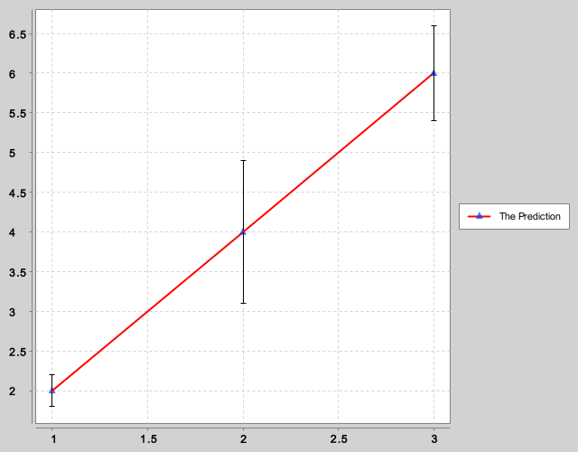
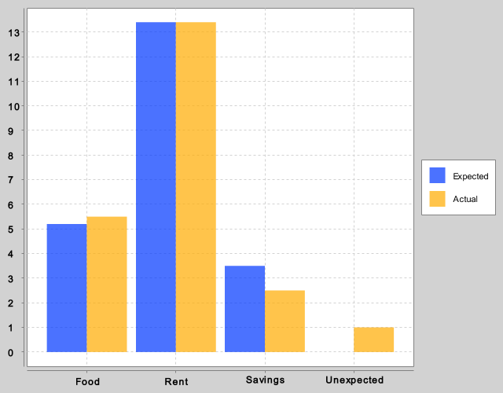

# Tutorial for clj-xchart

clj-xchart is a Clojure wrapper over the Java library
[XChart](http://knowm.org/open-source/xchart/), which is a lightweight library
for plotting data. If you feel Incanter is a bit too much for just plotting,
then this may be a potential candidate.

clj-xchart has a small set of functions, but roughly 1 million different render
style options. We'll skip those here, but feel free to look at the
[render-options](render-options.md) page if you want to know what you can and
cannot configure.

To play around with clj-xchart, you can either use
[lein-try](https://github.com/rkneufeld/lein-try):

```shell
$ lein try com.hypirion/clj-xchart
```

or [inlein](http://inlein.org/):

```clj
#!/usr/bin/env inlein

'{:dependencies [[org.clojure/clojure "1.8.0"]
                 [com.hypirion/clj-xchart "0.1.0"]]}

;; your code here
```

## XY-Charts

The most straightforward chart type is the XY-chart: It plots line plots. To
create a XY-chart, we use the `xy-chart` function:

```clj
(require '[com.hypirion.clj-xchart :as c])

user=> (def chart
         (c/xy-chart {"Expected rate" [(range 10) (range 10)]
                      "Actual rate" [(range 10) (map #(+ % (rand-int 5) -2) (range 10))]}))
#'user/chart

user=> (c/view chart)
```

This should show you something à la this:


All functions which creates charts start with the series they should contain.
The series is a map from strings to the content of the series – which depends on
what type of chart you want. For a simple xy-chart, this is a vector of 2 or 3
sequences of numbers. The first sequence is the x values, the second is the y
values, and the optional last one is the error bars.

```clj
user=> (def series {"The Prediction" [[1 2 3] ;; X
                                      [2 4 6] ;; Y
                                      [0.2 0.9 0.6]]}) ;; error-bars (optional)
#'user/series
user=> (def error-bars (c/xy-chart series))
#'user/error-bars
user=> (c/view error-bars)
```


The `view` function, which we've used two times already, is just a utility
function which renders the chart for you in a window. It is variadic: You can
view multiple charts in the same command if you want to compare them against
each other (I usually do this when I want to figure out which one looks best):

```clj
user=> (c/view chart error-bars)
```

### Verbose

All series values can also be on a "verbose" form. If we go back to the content
of the error-bars example:

```clj
{"The Prediction" [[1 2 3] ;; X
                   [2 4 6] ;; Y
                   [0.2 0.9 0.6]]})
```

Then the same data can be written like this:

```clj
{"The Prediction" {:x [1 2 3]
                   :y [2 4 6]
                   :error-bars [0.2 0.9 0.6]}}
```

These two forms are identical, but the latter is more self-describing. Use the
form which fits with how you extract your data.

One thing you can do with the "verbose" form which you cannot do with the vector
form is to attach styling:

```clj
{"The Prediction" {:x [1 2 3]
                   :y [2 4 6]
                   :error-bars [0.2 0.9 0.6]
                   :style {:marker-type :triangle-up
                           :line-color :red}}}
```

This will render as follows:



## Category Charts

You can also render category charts with clj-xchart: This is done via
`category-chart*`. The most famous type of category chart is probably the bar
chart, but other variants exist. One difference between between XY-charts and
category charts are their inputs: The X-axis of a category chart can either be
numbers, dates or strings, whereas the X-axis of an XY-chart can only be
numbers. Another difference is that the X-axis isn't "sorted", that is, if the
X-axis is `[100 -20]`, then 100 will be rendered first, then -20.

Let's have a look at one:

```clj
user=> (def expected [["Food" "Savings" "Rent"]
                      [5.2 3.5 13.4]])
#'user/expected

user=> (def actual [["Food" "Savings" "Rent" "Unexpected"]
                    [5.5 2.5 13.4 1.0]])
#'user/actual

user=> (def chart (c/category-chart* {"Expected" expected
                                      "Actual" actual}))
#'user/chart

user=> (c/view chart)
```


Here you see one of the many potential pitfalls of the category chart:
"Unexpected" was not printed! XChart seems to only use the rows that are
contained in the first input series, and since we use a map, we cannot be 100%
sure of which series is given as input to XChart first.

Another issue with the category chart is that we often have mappings on the form

```clj
{"Food" 5.2
 "Savings" 3.5
 "Rent" 13.4}
```

instead of having a vector of keys and a vector of vals. But this won't work if
we want to use the "verbose" form.

To keep things easy to use, there is a convenience wrapper named
`category-chart` (without the `*`). It will detect content on the shape
described above and transform it into something `category-chart*` can handle
without "surprising" behaviour.

Additionally, since maps do not usually contain any ordering, you can specify
the ordering through its 2-arity version. Since you can both order the series
and the x values, depending on what you need:

```clj
user=> (def expected {"Food" 5.2
                      "Savings" 3.5
                      "Rent" 13.4})
#'user/expected

user=> (def actual {"Food" 5.5
                    "Savings" 2.5
                    "Rent" 13.4
                    "Unexpected" 1.0})

#'user/actual

user=> (def chart (c/category-chart {"Expected" expected
                                     "Actual" actual}
                                    {:series-order ["Expected" "Actual"]}))
#'user/chart

user=> (c/view chart)
```



Extra rows that are not included in the ordering will be printed in alphanumeric
order. If none are provided, then they will be all be sorted by alphanumeric
values.

```clj
user=> (def chart (c/category-chart {"Expected" expected
                                     "Actual" actual}
                                    {:x-axis {:order ["Rent" "Food"]}}))
#'user/chart

user=> (c/view chart)
```


In this example, the series order is ordered alphanumerically, and the
additional x-axis values Savings and Unexpected will be sorted alphanumerically
as well.

### Overlapping/Stacked category charts

Another way of representing the same data is by stacking the data on top of
eachother. This is possible via the `:overlap?` styling option. In that case, we
should transpose the data for it to make some sense:

```clj
(def food {"Expected" 5.2, "Actual" 5.5})
(def rent {"Expected" 13.4, "Actual" 13.4})
(def savings {"Expected" 3.5, "Actual" 2.5})
(def unexpected {"Actual" 1.0})

user=> (def chart (c/category-chart {"Food" food
                                     "Rent" rent
                                     "Savings" savings
                                     "Unexpected" unexpected}
                                     {:overlap? true
                                      :x-axis {:order ["Expected" "Actual"]}}))
```


