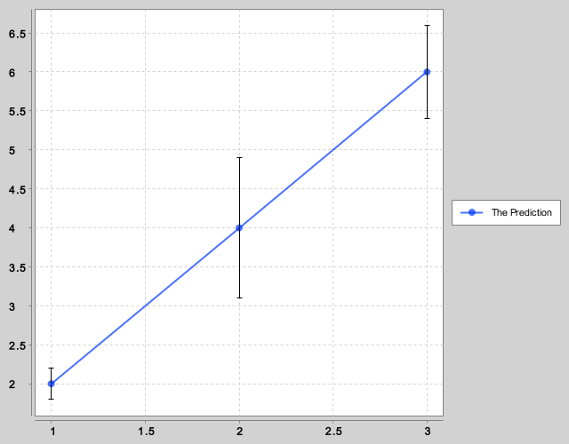

# Tutorial for clj-xchart

clj-xchart is a Clojure wrapper over the Java library
[XChart](http://knowm.org/open-source/xchart/), which is a lightweight library
for plotting data. If you feel Incanter is a bit too much for just plotting,
then this may be a potential candidate.

clj-xchart has a small set of functions, but roughly 1 million different render
style options. We'll skip those here, but feel free to look at the
[render-options](render-options.md) page if you want to know what you can an
cannot configure.

To play around with clj-xchart, you can either use
[lein-try](https://github.com/rkneufeld/lein-try):

```shell
$ lein try com.hypirion/clj-xchart
```

or [inlein](http://inlein.org/):

```clj
#!/usr/bin/env inlein

'{:dependencies [[org.clojure/clojure "1.8.0"]
                 [com.hypirion/clj-xchart "0.1.0"]]}

;; your code here
```

## XY-Charts

The most straightforward chart type is the XY-chart: It plots line plots as
we're used to. To create a xy-chart, we use the `xy-chart` function:

```clj
(require '[com.hypirion.clj-xchart :as c])

user=> (def chart
         (c/xy-chart {"Expected rate" [(range 10) (range 10)]
                      "Actual rate" [(range 10) (map #(+ % (rand-int 5) -2) (range 10))]}))
#'user/chart

user=> (c/view chart)
```

This should show you something à la this:


All functions which creates charts start with the series they should contain.
The series is a map from strings to the content of the series – which depends on
what type of chart you want. For a simple xy-chart, this is a vector of 2 or 3
sequences of numbers. The first sequence is the x values, the second is the y
values, and the optional last one is the error bars.

```clj
user=> (def series {"The Prediction" [[1 2 3] ;; X
                                      [2 4 6] ;; Y
                                      [0.2 0.9 0.6]]}) ;; error-bars (optional)
#'user/series
user=> (def error-bars (c/xy-chart series))
#'user/error-bars
user=> (c/view error-bars)
```



The `view` function, which we've used two times already, is just a utility
function which renders the chart for you in a window. It is variadic: You can
view multiple charts in the same command if you want to compare them against
each other (I usually do this when I want to figure out which one looks best):

```clj
user=> (c/view chart error-bars)
```
